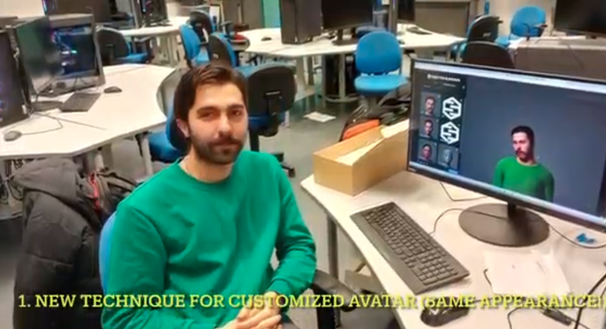

# Meta-Cognitive 3D AI Avatar

## Paper
Meta-Cognitive 3D AI Avatar
A Preliminary Demo in Virtual Reality
 Seyed Mahdi Mehrpour Moghadam<sup>1</sup>,
 Haoyu Chen<sup>1,*</sup>

 <sup>1</sup>  Center for Machine Vision and Signal Analysis, University of Oulu, Finland
 <sup>*</sup>  Corresponding author

## Abstract
This paper presents a preliminary demo for designing AI avatars that enhance human-machine interaction through emotional and cognitive realism. At its core, we propose a novel theoretical model that aims to integrate affective computing, self-reflective meta-cognition to enable AI avatars to simulate human-like emotional intelligence and decision making processes. Specifically, on the top of Large Language Models (LLMs), we introduce a meta-cognitive module into the AI avatar design, serving as a third party to monitor and simulate the self-awareness of the AI models. To demonstrate the feasibility of our framework, we developed a functional prototype (demo) that showcases the avatar's ability to engage in realistic, context-aware interactions. While quantitative validation remains for future work, this preliminary attempt provides a preliminary contribution to the field of emotionally intelligent AI and offers practical insights into the design of next-generation human-machine interfaces.


## Demo link

[](https://youtu.be/vMBMX__ABxo)


## Source code
Coming soon

## Citation
```
@article{chen2025avatar,
  title={Meta-Cognitive 3D AI Avata: A Preliminary Demo in Virtual Reality},
  author={Mehrpour Moghadam Seyed Mahdi and Chen Haoyu},
  journal={Hybrid Human Artificial Intelligence, Demo track},
  year={2025},
}
```
